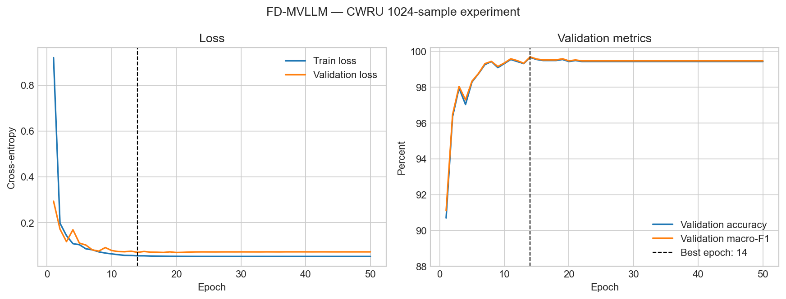

# FD-MVLLM: Fault Diagnosis Based on Multimodal Vibration Data and Large Language Model for Bearing System


仓库包含原始训练入口、精度增强入口、适合服务器断线续训的入口，以及与模型四通道图像分支匹配的CWT生成脚本。

## 主要功能

- 振动时序与CWT时频图像的多模态融合。
- 13项时域/频域统计特征组成的文本Prompt。
- Patch Reprogramming将非文本特征映射到LLM嵌入空间。
- LoRA参数高效微调。
- LLM最后多层隐藏特征融合后接独立分类头。
- 分层训练/验证/测试划分、梯度累积、梯度裁剪。
- 最佳验证模型保存、断线续训、训练状态和日志落盘。
- CSV窗口与CWT图像的自然排序和一一对应检查。

## 基于CWRU的实验结果（复现及提升）

### V1.4 
合并所有采样频率为12kHz的csv。模型主体架构不变，使用Codex，以提升模型的准确率为目标。
| 指标 | 结果 |
|---|---:|
| 训练/验证/测试样本 | 14,025 / 1,753 / 1,754 |
| 最终验证轮次 | 50 |
| 最终验证Loss | 0.072866 |
| 最终验证准确率 | **99.42%** |
| 最终验证Macro-F1 | **0.9947** |
| 测试Loss | 0.091272 |
| 测试准确率 | **98.9168%** |
| 测试Macro-F1 | **0.9893** |
| 总训练时间 | 6.60小时 |

### V1.3
使用采样频率为12kHz，转速为1750的csv，即单工况。




主要实验参数：

| 参数 | 值 |
|---|---:|
| Sampling rate | 12,000 Hz |
| Window / overlap | 1024 / 512 |
| Patch length / stride | 16 / 8 |
| LLM hidden size / layers | 4096 / 4 |
| LoRA rank / alpha | 32 / 64 |
| Batch size / gradient accumulation | 8 / 2 |
| Task LR / LoRA LR | 2e-4 / 1e-4 |
| Weight decay | 1e-3 |
| Label smoothing | 0.01 |
| Training epochs | 50 |


## 项目结构

```text
.
├── README.md
├── requirements.txt
├── run_main.py                       # 原始/基线训练入口
├── run_main_accuracy.py              # 推荐的精度增强入口
├── run_main_accuracy_resilient.py    # 懒加载、自动恢复、服务器训练入口
├── pic_gen_pool.py                   # 原始CWT生成脚本
├── pic_gen_pool_accuracy.py          # 推荐的CWT生成脚本
├── pic_gen_pool_cal.py               # 低频范围CWT实验脚本
├── layers/
│   └── StandardNorm.py
├── models/
│   └── Classification.py
├── utils/
│   ├── my_read_data.py
│   └── tools.py
├── scripts/
│   └── plot_training_history.py
├── assets/
│   └── training_curves.png
└── results/
    └── cwru_1024_llama/
        ├── config.json
        ├── summary.json
        └── training_history.csv
```

## 环境安装

推荐Python 3.10和支持BF16的NVIDIA GPU。Llama + LoRA rank 32训练建议至少24 GB显存，32 GB显存更稳妥。

```bash
git clone <YOUR_REPOSITORY_URL>
cd FD-MVLLM-GitHub

conda create -n fdmvllm python=3.10 -y
conda activate fdmvllm
pip install -r requirements.txt
```

如果需要指定CUDA版本，请先按照PyTorch官方安装说明安装匹配的 `torch==2.2.2` 和 `torchvision==0.17.2`，再安装其余依赖。

## 数据准备

数据集和预训练LLM权重不包含在仓库中。推荐目录结构：

```text
data/
└── CWRU/
    ├── csv/
    │   ├── normal.csv
    │   ├── inner_race.csv
    │   ├── outer_race.csv
    │   └── rolling_element.csv
    └── cwt/
        ├── normal/
        ├── inner_race/
        ├── outer_race/
        └── rolling_element/

pretrained/
└── Llama/
    ├── config.json
    ├── tokenizer.model
    └── ...
```

当前数据读取逻辑按照CSV文件的自然排序分配类别编号，并要求每个CSV文件对应一个同名CWT图片目录。用于四分类时，输入目录应整理为4个类别CSV；如果一个故障类别包含多个CSV文件，需要先增加显式标签映射逻辑。

## 生成CWT图像

推荐使用精度增强脚本：

```bash
python pic_gen_pool.py \
  --input_dir data/CWRU/csv \
  --output_root data/CWRU/cwt \
  --sampling_frequency 12000 \
  --window_size 1024 \
  --overlap 512 \
  --min_frequency 1 \
  --max_frequency 512 \
  --workers 8
```

生成结果为128×128 RGBA PNG，与模型的四通道CNN输入一致。如果CSV没有表头，增加 `--no_header`；覆盖已有图像时显式增加 `--overwrite`。

## 训练

以下命令对应已记录的CWRU 1024点实验配置：

```bash
python run_main_accuracy.py \
  --csv_root data/CWRU/csv \
  --image_root data/CWRU/cwt \
  --sampling_rate 12000 \
  --llm_model deepseek \
  --llm_model_root pretrained/Llama \
  --window_size 1024 \
  --overlap 512 \
  --patch_len 16 \
  --stride 8 \
  --d_model 32 \
  --llm_layers 4 \
  --train_epochs 50 \
  --batch_size 8 \
  --gradient_accumulation_steps 2 \
  --early_stopping_patience 100 \
  --output_dir results/my_cwru_1024_llama
```

训练输出包括：

- `config.json`：实际参数、样本数和归一化统计。
- `training_history.csv`：逐轮Loss、准确率、F1和学习率。
- `summary.json`：最佳验证结果和最终测试结果。
- `best_trainable_state.pt`：最佳可训练参数。


## 重新绘制训练曲线

```bash
python scripts/plot_training_history.py \
  results/cwru_1024_llama/training_history.csv \
  assets/training_curves.png \
  --best-epoch 14
```

## 结果解释与复现注意事项（普遍炼丹经验）

1. 当前指标采用窗口级分层随机划分，训练/验证/测试比例为8:1:1。
2. 窗口重叠为512点，相邻重叠窗口可能被分到不同集合，因此该结果不等价于轴承级、工况级或跨域泛化结果。
3. 更严格的论文比较建议按照轴承编号或原始记录分组划分，避免相邻窗口泄漏。
4. 结果依赖本地Llama具体版本、CWT生成参数、CSV文件排序和随机种子。
5. CWT图像必须与CSV窗口数量和顺序严格一致，训练入口会进行数量与RGBA通道检查。
6. 模型准确度结果与CWT图像质量、模型层数，损失函数等密切相关。
7. FD-MVLLM为故障诊断模型，适用的数据集为JNU,CWRU,PU，RUL研究领域的数据集有待验证。
8. 


The latest concise version is available on Tag; please go there. This is also to differentiate it from the Time-LLM documentation.

Cite:

[1] M. Jin, S. Wang, L. Ma, Z. Chu, J.Y. Zhang, X. Shi, P.-Y. Chen, Y. Liang, Y.-F. Li, S. Pan, Q.J.a.e.-p. Wen, Time-LLM: Time Series Forecasting by Reprogramming Large Language Models, 2023, pp. arXiv:2310.01728.https://doi.org/10.48550/arXiv.2310.01728.

[2] Li D, Pang Z, Chen Y, et al. FD-MVLLM: Fault diagnosis based on multimodal vibration data and large language model for bearing system[J]. Mechanical Systems and Signal Processing, 2025, 239: 113226.

Public datasets:

[3] JNU dataset:https://github.com/ClarkGableWang/JNU-Bearing-Dataset

[4] CWRU dataset:https://engineering.case.edu/bearingdatacenter/download-data-file

[5] PU dataset:https://mb.uni-paderborn.de/konstruktions-und-antriebstechnik-kat/forschung/bearing-datacenter/data-sets-and-download

